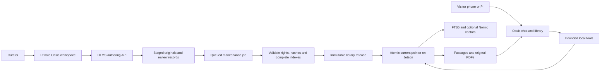

# Oasis library architecture

Architecture and implementation direction, 8 October 2026. Kuwala's DLMS fork
is the private authoring system for Oasis Library. The first implementation
retains Django and the existing React/Material UI framework, with Oasis styling.
Visitors use the station reader and chat; curators use the authenticated private workspace on
the Jetson. Both operate on the same logical collection: authoring records and
verified immutable reader snapshots. The [catalogue transfer](OASIS_CATALOGUE_TRANSFER.md)
preserves the existing main collection's IDs, original files, metadata and
review scope and can adopt its matching verified index. Publication enforcement,
fine-grained curator/reviewer/publisher roles and the larger integrations below remain follow-ups.
The device manager uses [standard Django staff sessions](OASIS_CURATOR_ACCESS.md)
with SSH access or an explicitly configured private Tailscale HTTPS origin.

## What the alpha has demonstrated

The initial SolarSPELL DLMS trial uploaded and exported two real English PDFs. Kuwala's
existing optional library profile imported 84 pages into 135 passages, built
FTS5 and local Nomic vectors, and answered through the actual Jetson Oasis app.
The reader links to original local PDFs and their page numbers. This establishes
a working route through the components; it is not a large-library benchmark.
The subsequent grouped pack contains five PDFs, 207 pages and 397 passages,
organised from DLMS folders as Farming, Water and Learning. Its vectors were
built locally on the Jetson. The practical questions revealed unsupported
summaries or abstention; they are tracked in Kuwala station issue #151.
Some earlier answers failed retrieval or citation checks. Tool use and valid
citations do not guarantee that every claim is supported.

The fork still needs maintained dependencies and enforced publishing rules.
Stock DLMS catalogue search covers metadata, not document bodies, and its build
does not enforce approval. The separate Content Curation backend trial also
found approval defects and could not complete upload without a ClamAV daemon.
No OCR, broad concurrency, multilingual quality or health-field validation has
been established. Keep those limits visible in the development plan.

## One interface, clear responsibilities

| Part | Responsibility | Suggested location |
|---|---|---|
| Oasis visitor interface | Chat, source selection, catalogue, passage reader and original PDF links | Jetson, accessed from phones or the Pi |
| Oasis curator workspace | Upload/review, organise documents, inspect jobs and publish releases | Private operator origin; laptop for development, optionally Pi later |
| DLMS Django API | Authoritative authoring metadata, private original files and review records | Updated fork on the curator host |
| Maintenance worker | Validate manifests/hashes, extract pages, build indexes and package releases | Existing Kuwala commands; Jetson for local Nomic embeddings |
| Published library | Immutable originals, manifest, passages and matching vector artifacts | Jetson local storage |

The current curator adapts the existing DLMS React interface and Django API;
the station reader shares Oasis's header and visual language. A later shared
Oasis React shell is a separate migration option. The deployed private Django
runtime listens only on Jetson loopback. Its device shell, APIs, exports,
originals and draft index endpoints require an active staff session in addition
to the loopback, origin and CSRF checks.

The Pi tailnet proxy stays a visitor gateway: approved readers and chat only.
It must not forward curator, upload or publishing endpoints. A curator host
being unavailable must not interrupt the Jetson's published library.

## Data records

| Record | Fields that must survive publication |
|---|---|
| Document | Stable safe slug, display title, collection/tags, language and authoring identity |
| DocumentVersion | Immutable version ID, original filename and SHA-256, byte size, publisher/source URL, authors, licence/URL, rights exceptions, review status/scope/reviewer/date, page count |
| LibraryRelease | Release/schema version, exact document versions, manifest hash, build state, extraction/index versions, creation time and publishing identity |
| Passage | Stable opaque ID, document version/file hash, PDF page number, chunk position, text and extraction version |
| Embedding artifact | Passage-index hash, embedding model name **and digest**, dimensions, prefixes, vector format/count and release binding |

Keep a logical Document separate from its immutable versions. Replacing a PDF
or changing published rights metadata creates a new version. Approval records
must state their scope: permission/text review is not expert review of technical
advice. Do not infer approval from an `active` flag or an automatically set date.
Preserve original attribution and item-level licence exceptions with the file.

## Upload, review and publish

1. Store uploads privately as staged versions. Validate size, type, filename and
   hash; record publisher provenance and rights. Never expose staging directories
   through the visitor file routes. Report encrypted/scanned/failed extraction.
2. A curator reviews the document and its intended use. Only explicitly approved
   versions are candidates for a release; rejected or incomplete jobs remain drafts.
3. Queue a maintenance job, using the existing Kuwala importer and vector builder.
   Extraction produces numbered PDF passages; FTS5 and Nomic remain derived indexes.
   Do not add a second ingestion pipeline inside Django.
4. Validate all required files, hashes, counts, manifests and index/model bindings.
   A failed build cannot become `current`. Preserve job diagnostics for the curator.
5. Publish an immutable release and atomically activate it on the Jetson. Keep the
   previous release for rollback. A question and its citations use one pinned snapshot.

For the alpha, require complete indexes for the selected publication profile.
If optional semantic search is unavailable, report that state and use the validated
lexical index; never silently reuse vectors from another document/model version.
Run heavy indexing in scheduled maintenance windows to avoid competing with chat.

## Question-time behaviour

Oasis passes its identity/system instructions and bounded conversation history
with every request. Tools list approved sources, search passages and open results.
Application code intersects selected sources and `@` tags with the published
catalogue, validates arguments and limits calls, time and returned text. A model
cannot widen that scope, browse arbitrary URLs or read upload directories.

Source text is reference material, not instructions to the application. Evidence
and page links come from opened records; missing material produces a clear miss.
Visitors can open the original local PDF or use direct library search without chat.
Wikipedia can remain a separate source through its existing ZIM adapter, grouped
in the same catalogue. Question-time PDF search, embeddings and inference stay local;
internet access is used for deliberate acquisition/update work, not required lookup.

## Phases

| Phase | Concrete work and completion check |
|---|---|
| 1 — Unified reading | One Oasis catalogue with PDF/Wikipedia labels, source selection/tags, original links and honest index availability. Verify answers resolve to the exact published version/page. |
| 2 — Curator workflow | Oasis upload/review screens over DLMS API, private staging, queued importer/vector jobs, diagnostics and publish/rollback controls. Keep development writes loopback-only. Test failed jobs cannot alter the current release. |
| 3 — Operational access | Add authenticated curator/reviewer/publisher roles and server-enforced transitions before exposing writes beyond loopback. Validate release packages and expand multilingual content with reviewers. |

Local development can use a curator workspace bound to loopback. Protected
writes must be implemented and tested before a public/LAN/tailnet curator
service is enabled.

## Alternatives and later updates

Embedding the entire Django app on the Jetson simplifies a small single-host
installation but adds an admin runtime and maintenance load beside inference.
Keeping authoring on a laptop/Pi adds a publishing connection but keeps visitor
operation independent. Replacing DLMS with a custom CMS gives full control while
recreating useful metadata and organisation work. Start with the fork and a thin
adapter, then move screens as needed instead of rewriting both applications.

Later remote delivery should treat application releases, model artifacts and
library releases as separate validated transactions, each with compatibility
metadata and rollback. A failed data/model update must preserve the running
application and current library. The first goal is a local alpha with reliable
publication and source access; remote updates follow that working contract.
