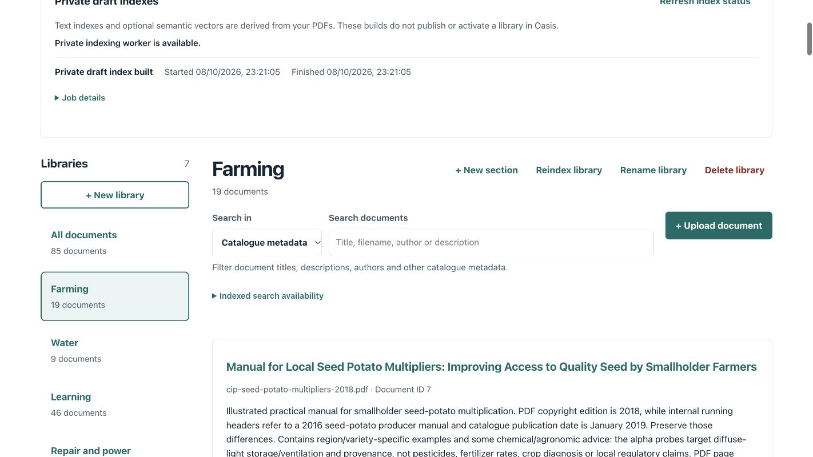
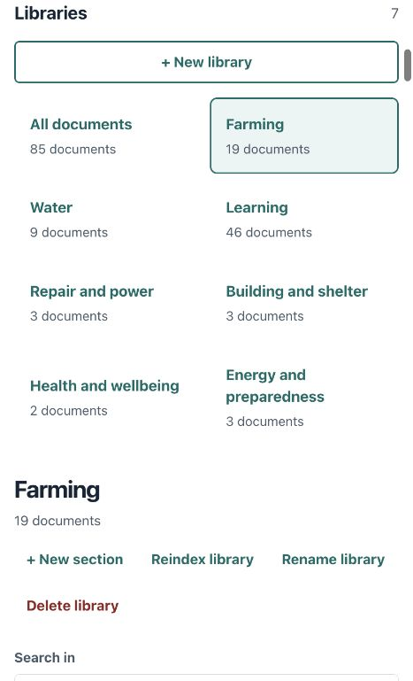
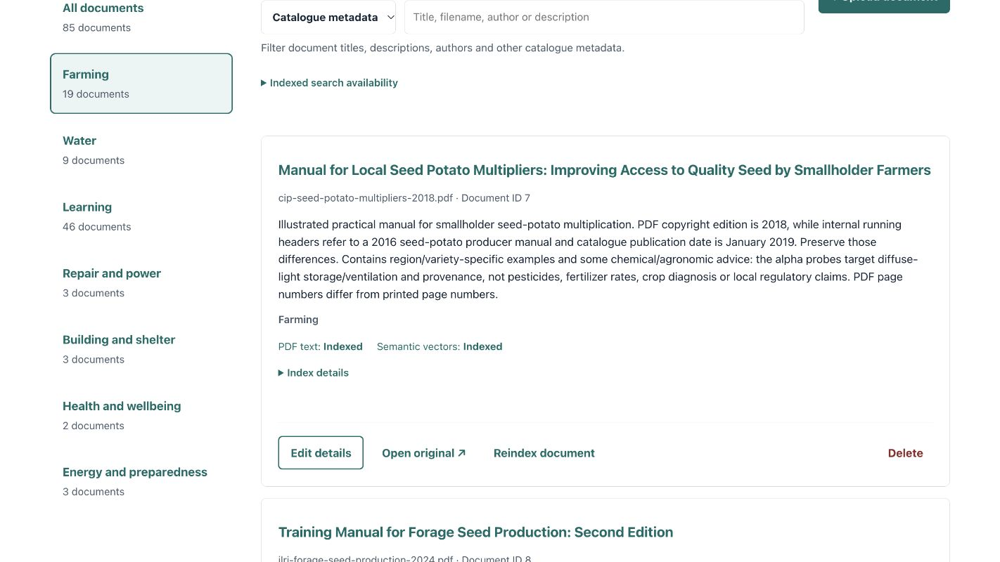

# Main Oasis catalogue — device verification, 8 October 2026

Manage Library had been commissioned with an empty authoring database while the existing Oasis reader served 85 PDFs. The private Jetson manager now manages the same main Oasis collection: one catalogue version, 85 original documents and seven sections. Existing document IDs, folder memberships, metadata, attribution, rights and original hashes were preserved.

| Section | Documents |
|---|---:|
| Farming | 19 |
| Water | 9 |
| Learning | 46 |
| Repair and power | 3 |
| Building and shelter | 3 |
| Health and wellbeing | 2 |
| Energy and preparedness | 3 |

All 85 documents show verified text and semantic indexes. The existing snapshot was validated and adopted: 11,426 pages and 18,802 passages. The private indexing worker is enabled and active. A real local semantic query returned Water passages with author, source, licence and original PDF page links; HTTP original bytes match the source hash.

The current reindex worker rebuilds the complete selected catalogue, including when requested from a section or document. The confirmation explains the 85-PDF scope. No unnecessary extraction or vector rebuild ran for this migration.

## Validation and deployment

- Installed curator release: `e25ce88f2047690aa91c342fadfcb8b09cbee14a`.
- 105 backend tests passed locally and on the installed Jetson ARM64 runtime, using disposable test state.
- 35 deployment/backup tests and the production frontend build passed.
- [PR #6](https://github.com/shoshin-labs/kuwala-dlms/pull/6) and [PR #7](https://github.com/shoshin-labs/kuwala-dlms/pull/7) were merged after successful checks. [Exact installed-commit CI](https://github.com/shoshin-labs/kuwala-dlms/actions/runs/37852820260) passed preview and Python 3.10/3.12 device jobs before deployment.
- Paired before-import and final-promotion backups were verified, including catalogue, originals, export builds, adopted indexing state, and import review/journal records.
- The published 85-document reader, original provenance and membership fingerprints stayed unchanged. The original evaluation and synthetic preview were preserved.

## Access and limits

Management remains private on the Jetson loopback interface, using the existing SSH access. No public management route or new authentication scheme was added. Phone-size screenshots verify the responsive layout of the actual device manager through that private connection; they do not imply a new remote management endpoint.

The review scope remains private development testing. Uploading, adopting an index or a successful build does not approve technical advice, broaden document rights or publish a new collection. New/replaced documents and changed memberships still need the operator's reviewed manifest and existing publication process. See the [catalogue transfer runbook](../../OASIS_CATALOGUE_TRANSFER.md) and [device deployment guide](../../OASIS_DEVICE_DEPLOYMENT.md).

## Actual-device screenshots

Desktop counts and active indexing worker:

Phone layout, all 85 documents and seven sections (466 CSS pixels, no horizontal overflow):

Real document indexing state and management actions:

